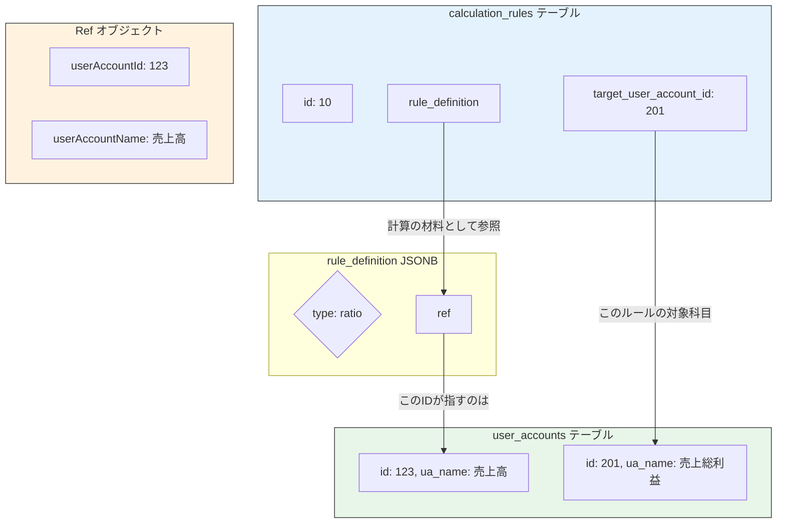

Calc*rule_JSONB_refs*関連議論.md

承知いたしました。
`Ref`オブジェクトの概念は、本システムの計算ロジックの根幹をなすため、誰が読んでもその位置付けと役割を正確に理解できることが不可欠です。

これまでの議論のすべてを反映し、初めてこの仕様に触れるエンジニアやLLMが、その全体像と詳細を把握できるよう、レポート形式でJSONスキーマを整理しました。

---

### **JSONスキーマ定義レポート: `Ref`オブジェクト**

#### **1. はじめに**

##### **1.1. 本資料の目的**

この資料は、本財務モデリングシステムの計算ロジック定義（`calculation_rules.rule_definition`）内で汎用的に使用される\*\*`Ref`オブジェクト\*\*のJSONスキーマ、その設計思想、およびシステム全体における位置付けを定義するものです。

本資料の読者は、このシステムのバックエンド開発を担当するエンジニアまたはLLMです。読者は、この資料を読むことで`Ref`オブジェクトの役割を完全に理解し、関連するロジックを正確に実装できる状態になることを目指します。

##### **1.2. `Ref`オブジェクトとは何か？**

`Ref`（Referenceの略）オブジェクトは、**「ある計算ルールが、どの勘定科目の、どの期間の値を参照しているか」** を示す、標準化された情報ブロックです。

これはデータベースの独立したテーブルではなく、`calculation_rules`テーブルの`rule_definition`カラム（JSONB型）の内部で、**部品として**繰り返し使用されるJSONオブジェクトです。計算ルールという「指示書」の中で、計算の材料となる特定の勘定科目を指し示すための、標準化された「**ポインター**」または「**付箋**」として機能します。

#### **2. `Ref`の概念の出所と進化**

この`Ref`という概念は、我々の議論の中でゼロから生まれたものではありません。その原型は、本プロジェクトの**初期に提供されたリポジトリのコード (`server/src/model/types.ts`)** に、以下の形式で既に定義されていました。

```typescript
// 提供されたリポジトリ内の初期定義
export type Ref = {
  accountId: string;
  period?: 'PREV' | 'SAME';
};
```

我々は、この優れた基本設計を継承しつつ、データベースでの永続化とシステムの堅牢性を向上させるために、これまでの議論を通じて以下のように進化させました。

1.  **参照の厳密化:** `accountId: string`という曖昧な参照から、`user_accounts`テーブルの主キーを直接参照する\*\*`userAccountId: integer`\*\*に変更しました。これにより、科目名が変更されても参照関係が壊れない、堅牢な設計を実現しました。
2.  **人間による検証性の追加:** システム的な正しさに加え、開発者がJSONを直接読んでデバッグする際の助けとなるよう、科目名を冗長的に保持する\*\*`userAccountName: string`\*\*を追加しました。

#### **3. システム全体における`Ref`の位置付けと関連**

`Ref`オブジェクトは、**ある`calculation_rules`レコード**と、その計算の材料となる**別の`user_accounts`レコード**とを繋ぐ、標準化された「**架け橋**」です。

##### **3.1. 関連図**

`Ref`は、`rule_definition` JSONBの様々な場所で、計算に必要な勘定科目を指し示すために使用されます。



上図は、「売上総利益（id: 201）のルールが、割合（`ratio`）計算のために売上高（id: 123）を参照する」という状況を示しています。`Ref`オブジェクトが、この二つの勘定科目間の参照関係を定義していることが分かります。

##### **3.2. `Ref`を理解するための検証ポイント**

あなたが初めてこのシステムに触れ、ある`Ref`オブジェクトの役割を正確に理解したい場合、以下の**3つの概念**を検証する必要があります。

1.  **`user_accounts`テーブルとの関係:**
    `Ref`オブジェクト内の`userAccountId`の値（例: `123`）は、必ず`user_accounts`テーブルの`id`カラムに存在するはずです。**この`user_accounts`レコードが、`Ref`が指し示す実体です。**

2.  **`rule_definition`内での文脈:**
    その`Ref`オブジェクトが、`rule_definition`JSONの**どのプロパティに含まれているか**を確認してください。
    - `ratio`ルールの`ref`プロパティにあれば、「**割合の計算元**」となる科目を指します。
    - `BALANCE_AND_CHANGE`ルールの`instructions`配列内の`driver`プロパティにあれば、「**残高の増減要因**」となる科目を指します。
    - 同じく`counter`プロパティにあれば、「**仕訳の相手勘定**」を指します。
      このように、`Ref`が置かれている場所（文脈）が、その役割を決定します。

3.  **`period`プロパティの値:**
    `Ref`オブジェクトに`period`プロパティが存在する場合、その値を確認してください。`'PREV'`であれば、参照先科目の**前期**の値を使うことを意味し、`'SAME'`または指定がなければ**当期**の値を使うことを意味します。

#### **4. `Ref`オブジェクトのJSONスキーマ**

最後に、`Ref`オブジェクト自身の厳密なJSONスキーマを以下に定義します。

```json
{
  "$schema": "http://json-schema.org/draft-07/schema#",
  "title": "Ref Object",
  "description": "計算ルール内で、他の単一の勘定科目を参照するための標準オブジェクトです。",
  "type": "object",
  "properties": {
    "userAccountId": {
      "description": "参照する勘定科目のID (user_accounts.id)。システムが計算時に使用する、不変の主キーです。",
      "type": "integer",
      "examples": [123]
    },
    "userAccountName": {
      "description": "参照する勘定科目の名称 (user_accounts.ua_name)。開発者がJSONを直接確認する際の可読性向上のための冗長データです。アプリケーションは、この値がuserAccountIdに対応する科目名と一致していることを保証する責務を負います。",
      "type": "string",
      "examples": ["売上高"]
    },
    "period": {
      "description": "どの期間の値を参照するかを示します。'PREV'は前期、'SAME'は当期を意味します。指定がない場合は'SAME'として解釈されます。",
      "type": "string",
      "enum": ["PREV", "SAME"]
    }
  },
  "required": ["userAccountId", "userAccountName"]
}
```
