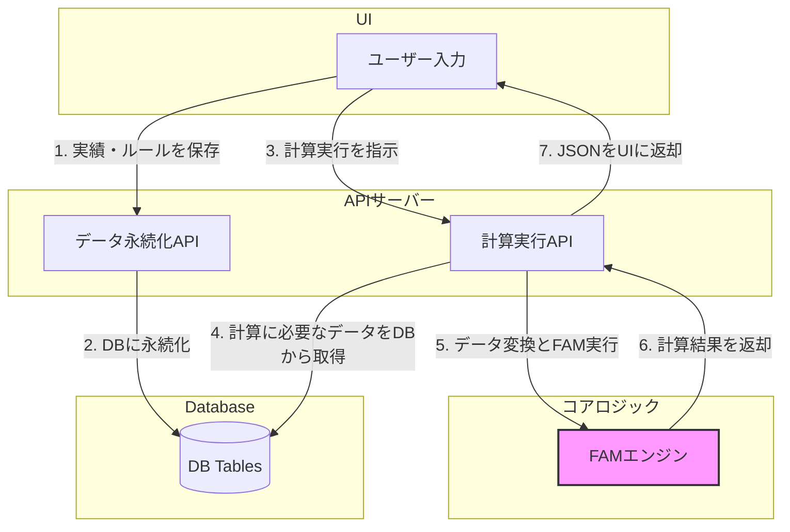

# UI-コアロジック連携仕様書 (改訂版 v2)

## 1. 目的

本仕様書は、UI/DB側コンポーネントとコア計算ロジック(`FAM`エンジン)の間のデータフローとインターフェースを明確に定義することを目的とする。両者が個別に開発されてきた中で生じている「何を、どの形式で、いつ渡すか」という連携の不透明性を解消し、財務モデル計算機能の実装に向けた具体的な設計図を提供する。

## 2. データフローの全体像

システム全体のデータフローは、以下のステップで構成される。



## 3. コアロジック (`FAM`) の入力仕様

`server/src/fam/fam.ts`のインターフェースに基づき、`FAM`クラスは以下の3種類のデータを必要とする。

1.  **`importActuals(PREVS, accountsMaster)`**
    - `PREVS: Record<string, number>[]`
      - **内容**: 複数年度分の実績データ。各要素が1年度分のスナップショット。オブジェクトのキーは`accountId`、値は数値。
      - **例**: `[{ "sales_id": 1000, "cogs_id": 600 }, { "sales_id": 1100, "cogs_id": 650 }]`
    - `accountsMaster: Account[]`
      - **内容**: モデルに存在する全勘定科目の定義情報。`id`, `AccountName`, `GlobalAccountID`, `fs_type`などを含む。

2.  **`setRules(rules)`**
    - `rules: Record<string, RuleInput>`
      - **内容**: `Parameters`型の計算ルール。オブジェクトのキーは`accountId`、値は`RuleInput`型（`{ type: '''GROWTH_RATE''', ... }`など）。

3.  **`setBalanceChange(cfis)`**
    - `cfis: CFI[]`
      - **内容**: `Balance & Change`型の計算ルール定義の配列。

## 4. DBからFAM入力へのデータ変換仕様

計算実行APIエンドポイントは、DBから取得したデータを以下の通り変換し、`FAM`に渡す責務を負う。

- **`accountsMaster`の生成**:
  - `server/api/userAccounts.ts`の`getUserAccounts`を参考に、`user_accounts`テーブルから全レコードを取得する。`parent_ga_name`などのJOINされた情報も有益。
  - 各レコードを`Account`型（`@server/src/model/types.ts`）にマッピングする。`id`は`user_accounts.id`を文字列化したもの（例: `String(row.id)`）を使用し、`accountId`として一貫させる。

- **`PREVS`の生成**:
  - `server/api/importData.ts`の`getImportData`を使い、対象モデルの`import_df`テーブルから`df_json`を取得する。
  - `df_json`は年度ごとの実績データ配列と想定される。これを`Record<string, number>[]`形式に変換する。この際、JSON内の勘定科目名やコードを、`accountsMaster`を使って`accountId`に解決する必要がある。

- **`rules`および`cfis`の生成**:
  - `server/api/calculationRules.ts`の`getCalculationRules`を使い、対象シナリオの`calculation_rules`テーブルから全レコードを取得する。
  - 各レコードをループし、`rule_type`プロパティで分岐させる。
    - `rule_type === '''PARAMETER'''`: `rule_definition` (JSONB) を`RuleInput`型に変換し、`rules`オブジェクトに`target_user_account_id`をキーとして追加する。
    - `rule_type === '''BALANCE_AND_CHANGE'''`: `rule_definition` (JSONB) を`CFI`型に変換し、`cfis`配列に追加する。
  - **重要**: DBの`rule_definition`はUIからの`config`を変換して作られている。コアロジックに渡すには、`fam.ts`が期待する`RuleInput`や`CFI`の形式に再変換する必要がある。この変換ロジックは計算実行API内に実装する。

## 5. コアロジック (`FAM`) の出力仕様

- **`getTable()`**: `FAM`の計算結果はこのメソッドで取得する。
  - **返り値**: `{ rows: any[], columns: string[], data: number[][] }`
  - このオブジェクトは直接JSONとしてシリアライズ可能であり、UI側でそのままテーブルとして描画するのに適している。`rows`には`accountId`や科目名が含まれるため、UIでの表示に利用できる。

## 6. 提案：計算実行APIエンドポイント

以上の仕様を実装するため、以下のAPIエンドポイントを新規に作成することを提案する。

- **Endpoint**: `POST /api/models/:modelId/calculate`
- **Request Body**:
  ```json
  {
    "scenarioId": "1",
    "projectionYears": 5
  }
  ```
- **処理フロー**:
  1.  リクエストから`modelId`, `scenarioId`, `projectionYears`を取得。
  2.  **[データ取得]** `userAccounts.getUserAccounts()`で`accountsMaster`を取得。
  3.  **[データ取得]** `importData.getImportData(modelId)`で実績データを取得し、`PREVS`に変換。
  4.  **[データ取得]** `calculationRules.getCalculationRules({ scenarioId })`でルール定義を取得し、`rules`と`cfis`に変換。
  5.  **[コアロジック実行]** `const fam = new FAM();`
  6.  `fam.importActuals(PREVS, accountsMaster);`
  7.  `fam.setRules(rules);`
  8.  `fam.setBalanceChange(cfis);`
  9.  `fam.compute({ years: projectionYears, ... });`
  10. **[結果返却]** `const resultTable = fam.getFlatData();` (新メソッド)
  11. `return c.json(resultTable);` (Honoの場合)

## 7. 【改訂】UI向け返却値 JSONスキーマ定義 (DDL準拠)

UI側エンジニアがDBスキーマを基準に開発を進めていることを考慮し、コアロジックからの返却値JSONスキーマをDDL (`user_accounts`, `global_accounts`テーブル) に準拠した形式に再定義する。

### 7.1. 設計方針

- **DDL準拠のキー**: JSONオブジェクトのキーを、`ua_id`, `ua_name`, `fs_type` のように、DDLのカラム名と一致させる。
- **UI表示情報の集約**: `indent_num` や `sort_num` など、UIでの階層表示やソートに直接利用できる情報をオブジェクトに含める。
- **フラットな行データ**: UIのDataGridで最も扱いやすいように、1セル=1オブジェクトのフラットな配列形式を採用する。
- **メタデータ**: 全体に関わる情報（モデルID、通貨など）は、ルートレベルの`metadata`オブジェクトにまとめる。

### 7.2. JSON構造の例 (DDL準拠版)

```json
{
  "metadata": {
    "modelId": 1,
    "scenarioId": 1,
    "calculationTimestamp": "2025-10-06T12:00:00Z",
    "currency": "JPY"
  },
  "financialData": [
    {
      "ua_id": 101,
      "ua_name": "売上高",
      "ua_code": "S-01",
      "fs_type": "PL",
      "is_kpi": true,
      "parent_ua_id": null,
      "parent_ga_id": "NET_SALES",
      "ga_name": "Net Sales",
      "sort_num": 10,
      "indent_num": 1,
      "period_id": 1,
      "period_label": "2024年度",
      "af_type": "Actual",
      "value": 1000
    },
    {
      "ua_id": 101,
      "ua_name": "売上高",
      "ua_code": "S-01",
      "fs_type": "PL",
      "is_kpi": true,
      "parent_ua_id": null,
      "parent_ga_id": "NET_SALES",
      "ga_name": "Net Sales",
      "sort_num": 10,
      "indent_num": 1,
      "period_id": 2,
      "period_label": "2025年度",
      "af_type": "Forecast",
      "value": 1100
    }
  ]
}
```

### 7.3. JSONスキーマ (DDL準拠版)

```json
{
  "$schema": "http://json-schema.org/draft-07/schema#",
  "title": "Financial Model Calculation Result (DDL-Aligned)",
  "type": "object",
  "required": ["metadata", "financialData"],
  "properties": {
    "metadata": {
      "type": "object",
      "properties": {
        "modelId": { "type": "integer" },
        "scenarioId": { "type": "integer" },
        "calculationTimestamp": { "type": "string", "format": "date-time" },
        "currency": { "type": "string", "default": "JPY" }
      }
    },
    "financialData": {
      "type": "array",
      "items": {
        "type": "object",
        "required": [
          "ua_id",
          "ua_name",
          "fs_type",
          "period_id",
          "period_label",
          "af_type",
          "value"
        ],
        "properties": {
          "ua_id": { "type": "integer", "description": "user_accounts.id" },
          "ua_name": {
            "type": "string",
            "description": "user_accounts.ua_name"
          },
          "ua_code": {
            "type": ["string", "null"],
            "description": "user_accounts.ua_code"
          },
          "fs_type": {
            "type": "string",
            "description": "user_accounts.fs_type (PL, BS, CF)"
          },
          "is_kpi": {
            "type": "boolean",
            "description": "user_accounts.is_kpi"
          },
          "parent_ua_id": {
            "type": ["integer", "null"],
            "description": "user_accounts.parent_ua_id"
          },
          "parent_ga_id": {
            "type": "string",
            "description": "user_accounts.parent_ga_id"
          },
          "ga_name": {
            "type": "string",
            "description": "JOINされたglobal_accounts.ga_name"
          },
          "sort_num": {
            "type": "integer",
            "description": "JOINされたglobal_accounts.sort_num"
          },
          "indent_num": {
            "type": "integer",
            "description": "JOINされたglobal_accounts.indent_num"
          },
          "period_id": { "type": "integer", "description": "periods.id" },
          "period_label": {
            "type": "string",
            "description": "periods.period_label (例: '''2025年度''')"
          },
          "af_type": {
            "type": "string",
            "description": "periods.af_type ('''Actual''' or '''Forecast''')"
          },
          "value": {
            "type": ["number", "null"],
            "description": "計算されたセルの値"
          }
        }
      }
    }
  }
}
```

### 7.4. コアロジックおよびAPIへの実装要件 (改訂)

このUIフレンドリーなJSONを出力するため、以下の実装を要求する。

- **`FAM`クラスの`getTable()`メソッドの改修**:
  - `getFlatData()`を新設する案は廃止し、`FAM`の主要な出力メソッドである`getTable()`が返す`rows`オブジェクトの内容を充実させる。
  - `getTable()`が返す`rows`配列の各要素に、`ua_id`, `ua_name`, `fs_type`などに加え、`ua_code`, `is_kpi`, `parent_ga_id`, `sort_num`, `indent_num`など、DDLに存在する主要なプロパティを含めるようにする。これは`importActuals`時に渡される`accountsMaster`から情報を引き継ぐことで実現する。

- **計算実行APIの改修**:
  - `POST /api/models/:modelId/calculate`エンドポイントは、`fam.getTable()`を呼び出す。
  - 呼び出し後、受け取ったマトリクス形式のデータ (`{ rows, columns, data }`) を、**API層の責務として**上記7.3のスキーマに合致するフラットな形式に「アンピボット」する変換処理を行う。
  - これにより、コアエンジン(`FAM`)は純粋な計算とマトリクス生成に集中し、UI向けの最終的な形式への変換はAPI層が担うという、**関心の分離**が実現できる。
